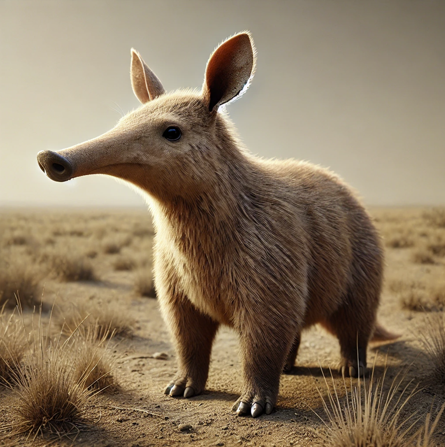

# Look-here 

## This is a utility for using a local llm + vision model with Ollama for asking questions about screenshots

### Steps to run

### 1. Install requirements
```bash
pip install -r requirements.txt
```
### 2. Install Ollama  
For linux:
```bash
curl -fsSL https://ollama.com/install.sh | sh
```
For windows:
https://ollama.com/download/windows

### 3. Run Ollama if its not already running
```bash
ollama serve
```
### 4. pull llama vision model
```bash
ollama pull llama3.2-vision
```
### 5. Take a screenshot


### 6. Run the script with a question
```bash
python look-here.py "What kind of animal is this?"
```


## License and Disclosure:
This project uses the [LLaMA 3.2 model](https://www.llama.com/llama3/license/) by Meta , which is provided under the terms of Meta's license. Please review Meta's license before using this project.
### Built with Meta LLama 3